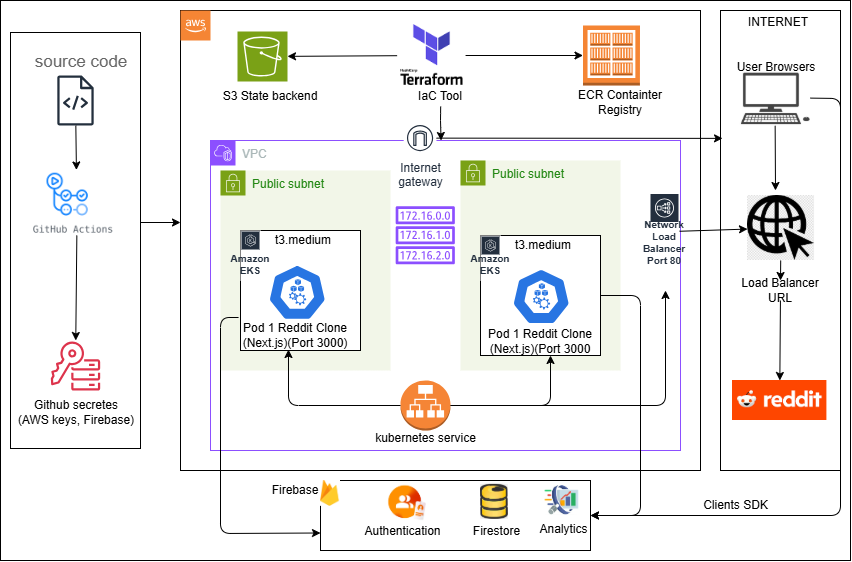

# Reddit Clone - AWS EKS Deployment

A production-ready Reddit clone deployed on AWS using GitHub Actions, Terraform, and Kubernetes.




**App URL**: [(http://a77e2a5ec26864ad1b57d89bce1245f3-8de3d6faa1c2be28.elb.us-west-2.amazonaws.com/)]

## 🏗️ Architecture Overview

- **Frontend**: Next.js React application
- **Backend**: Firebase (Authentication, Firestore, Storage)
- **Infrastructure**: AWS EKS (Kubernetes)
- **CI/CD**: GitHub Actions
- **IaC**: Terraform
- **Container Registry**: AWS ECR
- **Load Balancer**: AWS Network Load Balancer

## 📋 Prerequisites

- AWS Account with appropriate permissions
- GitHub repository
- Firebase project setup

## ⚙️ Setup Instructions

### 1. Configure GitHub Secrets

Add secrets in your GitHub repository (Settings → Secrets and variables → Actions):


### 2. Update S3 Backend

Edit `Eks-terraform/backend.tf` with your S3 bucket name:

```hcl
terraform {
  backend "s3" {
    bucket = "your-terraform-state-bucket"
    key    = "EKS/terraform.tfstate"
    region = "us-west-2"
  }
}
```

### 3. Deploy Infrastructure

**Option A: Automatic (Push to main)**
```bash
git push origin master
```

**Option B: Manual (GitHub Actions)**
1. Go to GitHub → Actions → "Deploy Reddit Clone to AWS EKS"
2. Click "Run workflow"
3. Select "deploy"
4. Click "Run workflow"

## 💰 Cost Management

### Estimated Monthly Costs:
- **EKS Cluster**: ~$73
- **EC2 Instances**: ~$60 (2x t3.medium)
- **Load Balancer**: ~$16
- **ECR Storage**: ~$1
- **Total**: ~$150/month

### 🛑 Destroy Resources

To avoid costs when not using:

1. Go to GitHub → Actions → "Deploy Reddit Clone to AWS EKS"
2. Click "Run workflow"
3. Select "destroy"
4. Click "Run workflow"

⚠️ **Warning**: This will permanently delete all resources and data!

## 🔧 Technical Stack

| Component | Technology |
|-----------|------------|
| **Frontend** | Next.js, React, Chakra UI |
| **Backend** | Firebase (Auth, Firestore, Storage) |
| **Container** | Docker |
| **Orchestration** | Kubernetes (EKS) |
| **Infrastructure** | Terraform |
| **CI/CD** | GitHub Actions |
| **Cloud Provider** | AWS |
| **Monitoring** | CloudWatch, Kubernetes logs |

## 📁 Project Structure

```
├── .github/workflows/     # GitHub Actions CI/CD
├── Eks-terraform/         # Terraform infrastructure code
├── src/                   # Next.js application source
├── public/               # Static assets
├── deployment.yml        # Kubernetes deployment
├── service.yml          # Kubernetes service
├── Dockerfile           # Container configuration
└── README.md           # This file
```

## 🚀 Features

- **Automated CI/CD**: Push code → Auto deploy to AWS
- **High Availability**: 2 replicas across multiple AZs
- **Scalable**: Kubernetes auto-scaling
- **Secure**: Environment variables via GitHub Secrets
- **Production Ready**: Health checks, monitoring, logging
- **Cost Optimized**: Manual destroy option

## 🔍 Monitoring & Debugging

**Check deployment status:**
```bash
kubectl get pods
kubectl get services
kubectl logs -l app=reddit-clone
```

**Access logs in GitHub Actions:**
- Go to Actions tab → Latest workflow run → View logs

## 🤝 Contributing

1. Fork the repository
2. Create a feature branch
3. Make changes
4. Push to your fork
5. Create a Pull Request

## 📄 License

MIT License - see LICENSE file for details

## 🆘 Troubleshooting

See [TROUBLESHOOTING.md](TROUBLESHOOTING.md) for common issues and solutions.

---

**Built with ❤️ using AWS, Kubernetes, and modern DevOps practices**